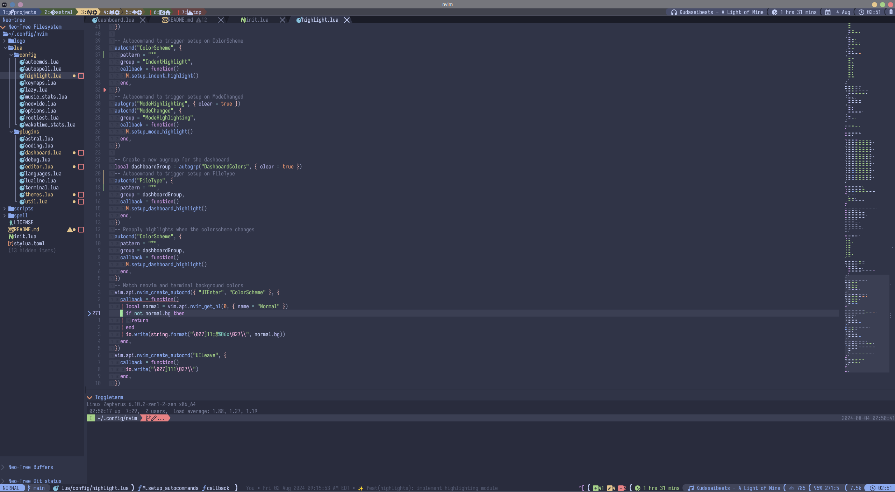
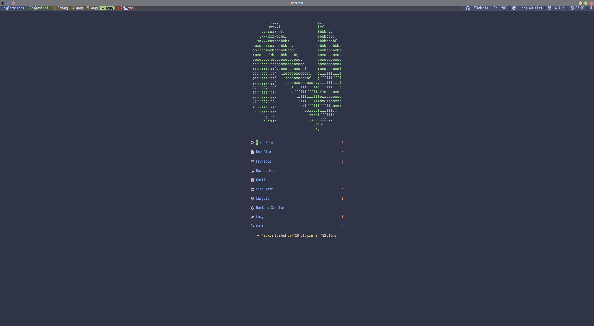
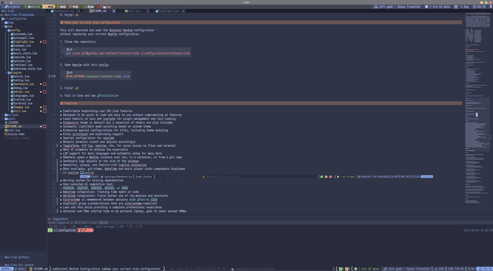
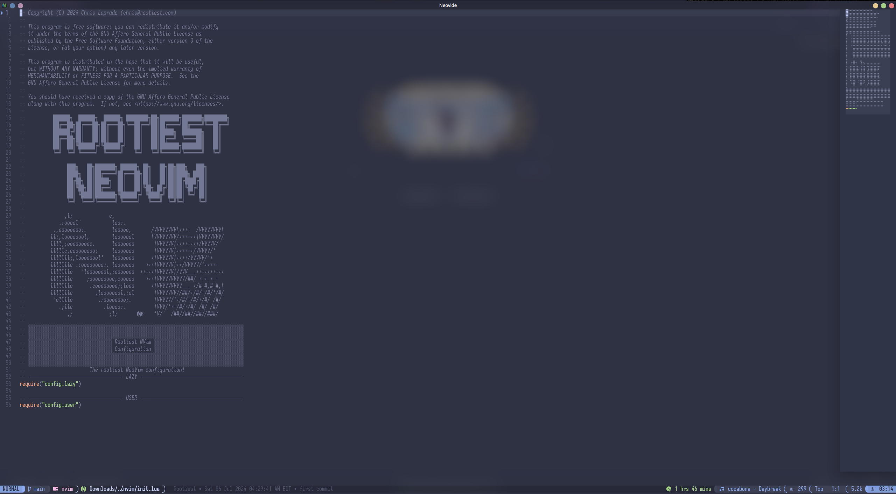

# Rootiest NeoVim Configuration

[](https://dotfyle.com/rootiest/rootiest-nvim)
[](https://dotfyle.com/rootiest/rootiest-nvim)
[](https://dotfyle.com/rootiest/rootiest-nvim)

```none
██████╗  ██████╗  ██████╗ ████████╗██╗███████╗███████╗████████╗
██╔══██╗██╔═══██╗██╔═══██╗╚══██╔══╝██║██╔════╝██╔════╝╚══██╔══╝
██████╔╝██║   ██║██║   ██║   ██║   ██║█████╗  ███████╗   ██║
██╔══██╗██║   ██║██║   ██║   ██║   ██║██╔══╝  ╚════██║   ██║
██║  ██║╚██████╔╝╚██████╔╝   ██║   ██║███████╗███████║   ██║
╚═╝  ╚═╝ ╚═════╝  ╚═════╝    ╚═╝   ╚═╝╚══════╝╚══════╝   ╚═╝
    ███╗   ██╗███████╗ ██████╗ ██╗   ██╗██╗███╗   ███╗
    ████╗  ██║██╔════╝██╔═══██╗██║   ██║██║████╗ ████║
    ██╔██╗ ██║█████╗  ██║   ██║██║   ██║██║██╔████╔██║
    ██║╚██╗██║██╔══╝  ██║   ██║╚██╗ ██╔╝██║██║╚██╔╝██║
    ██║ ╚████║███████╗╚██████╔╝ ╚████╔╝ ██║██║ ╚═╝ ██║

      ,l;             c,
   .:ooool'           loo:.
 .,oooooooo:.         looooc,       /VVVVVVVV\++++  /VVVVVVVV\
ll:,loooooool,        looooool      \VVVVVVVV/++++++\VVVVVVVV/
llll,;ooooooooc.      looooooo       |VVVVVV|++++++++/VVVVV/'
lllllc,coooooooo;     looooooo       |VVVVVV|++++++/VVVVV/'
lllllll;,loooooool'   looooooo      +|VVVVVV|++++/VVVVV/'+
lllllllc .:oooooooo:. looooooo    +++|VVVVVV|++/VVVVV/'+++++
lllllllc   'loooooool,:ooooooo  +++++|VVVVVV|/VVV___++++++++++
lllllllc     ;ooooooooc,cooooo    +++|VVVVVVVVVV/##/ +_+_+_+
lllllllc      .coooooooo;;looo      +|VVVVVVVVV___ +/#_#,#_#,\
lllllllc        ,loooooool,:ol       |VVVVVVV//##/+/#/+/#/'/#/
 'cllllc         .:oooooooo;.        |VVVVV/'+/#/+/#/+/#/ /#/
   .;llc           .loooo:.          |VVV/'++/#/+/#/ /#/ /#/
      ,;             ;l;             'V/'  /##//##//##//###/
```

The rootiest neovim configuration you will ever see!

## Pre-requisites

> Note:
> While NeoVim may run without these prerequisites,
> functionality will be limited.  
> For the full experience, it is recommended to install the pre-requisites.

### Required

- [git](https://git-scm.com/) -
  Version control system
- [luarocks](https://luarocks.org/) -
  Lua package manager
- [Nerd Fonts](https://github.com/ryanoasis/nerd-fonts/) -
  Font with extended glyphs

Your terminal/client application **_must_** have a Nerd Font installed
and support the Nerd Font glyphs.

WezTerm, Kitty, or NeoVide are recommended.

### Optional

- [ripgrep](https://github.com/BurntSushi/ripgrep) -
  A faster grep
- [fzf](https://github.com/junegunn/fzf) -
  A command-line fuzzy finder
- [fd](https://github.com/sharkdp/fd) -
  A simple, fast and user-friendly alternative to 'find'
- [lazygit](https://github.com/jesseduffield/lazygit) -
  A simple terminal UI for git commands
- [kitty](https://sw.kovidgoyal.net/kitty/) -
  A fast, feature-rich, GPU based terminal emulator
- [NeoVide](https://neovide.dev/) -
  A fast, feature-rich, and modern NeoVim GUI
- [fish](https://fishshell.com/) -
  A smart and user-friendly command line shell

## Installation

1. Install [NeoVim](https://github.com/neovim/neovim/blob/master/INSTALL.md) (0.9+)
2. Install Pre-requisites
3. Backup your current nvim configuration (if you have one)

   ```sh
   mv ~/.config/nvim ~/.config/nvim.bak
   ```

4. Clone the repository

   ```sh
   git clone git@github.com:rootiest/rootiest-nvim ~/.config/nvim
   ```

5. Enjoy! 🎉

## Keep your current nvim configuration

This will download and open the Rootiest NeoVim configuration  
without replacing your current NeoVim configuration.

1. Clone the repository

   ```sh
   git clone git@github.com:rootiest/rootiest-nvim ~/.config/rootiest/rootiest-nvim
   ```

2. Open Neovim with this config:

   ```sh
   NVIM_APPNAME=rootiest/rootiest-nvim/ nvim
   ```

3. Enjoy! 🎉

4. Fall in love and see [Installation](#installation)

## Features

- Comfortable keybindings and IDE-like features
- Designed to be quick to load and easy to use without compromising on features
- Leans heavily on lazy and luarocks for plugin management and lazy-loading
- Catppuccin theme is default but a selection of others are also included
- Automatic light/dark mode switching based on system theme
- Extensive special configurations for kitty, including theme matching
- Kitty scrollback and keybinding support
- Special configuration for neovide
- Detects terminal client and adjusts accordingly
- ToggleTerm, fzf-lua, neotree, etc. for quick access to files and terminal
- Many UI elements to enhance the experience
- LSP support for many languages and automatic setup for many more
- Remotely spawn a NeoVim instance over ssh, in a container, or from a git repo
- Dashboard logo adjusts to the size of the window
- Beautiful, unique, and feature-rich lualine statusline
- When available, git-blame, WakaTime and music player stats components displayed
  in lualine 
- Warning system for missing dependencies
- User-selected AI completion tool:
  `codeium`, `copilot`, `tabnine`, `minuet`, or `none`
- WakaTime integration: Tracking time spent on code
- Hardtime integration: Trains better use of vim motions and shortcuts
- Colorscheme is remembered between sessions with [astral.nvim](https://github.com/rootiest/astral.nvim)
- Highlight group customizations that are colorscheme-compliant
- Lean and fast while providing a complete professional experience
- Achieves sub-75ms startup time on my personal laptop, goal to never exceed 100ms
- Now with more efficient, refactored keymappings!

## Screenshots

Features and

<details>
   <summary>Main NeoVim PDE</summary>



</details>

<details>
   <summary>Dashboard</summary>



</details>

<details>
   <summary>Markdown view with inline images</summary>



</details>

<details>
   <summary>Neovide Transparency</summary>



</details>

## Options

Options are configured in the `config/options.lua` file under the `ROOTIEST` header.

The default values are:

```lua
--  ━━━━━━━━━━━━━━━━━━━━━━━━━━━━━━ ROOTIEST ━━━━━━━━━━━━━━━━━━━━━━━━━━━━━━━
vim.g.aitool      = "codeium" --Options:  codeium, copilot, tabnine, minuet, none
vim.g.usewakatime = true      --Options:  true, false
vim.g.usehardtime = false     --Options:  true, false
vim.g.useimage    = true      --Options:  true, false
```

## Companion Tools

[Rootiest Kitty Conf](https://github.com/rootiest/rootiest-kitty) -
A kitty configuration that is designed to work with this NeoVim configuration

[Rootiest Fish Conf](https://github.com/rootiest/rootiest-fish-conf) -
A fish configuration that pairs well with this NeoVim configuration

[Nerd Fonts](https://github.com/ryanoasis/nerd-fonts/) -
A collection of fonts that includes many icons and glyphs used in this configuration.

## Dotfiles

[Rootiest Dotfiles](https://github.com/rootiest/dotfiles)

## Credits

- [Folke Lamaitre](https://github.com/folke)
- [LazyVim](https://github.com/LazyVim/LazyVim)
- [Elijah Manor](https://github.com/elijahmanor/elijahmanor)
