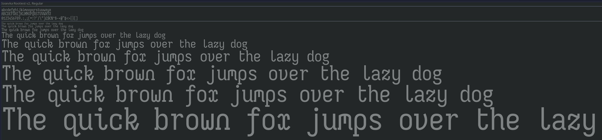

# Rootiest Iosevka Fonts

This is a collection of Iosevka font variants that are used in the rootiest configurations.



## Version

This font was built using
[Iosevka](https://github.com/be5invis/Iosevka) version 31.7.1

The Nerd Font patches were built using
[Nerd Fonts](https://github.com/ryanoasis/nerd-fonts) version 3.2.1

## Installation

[Install the Rootiest Neovim config](../README.md#installation)

### Linux

```bash
cd ~/.config/nvim/fonts
cp *.{otf,ttf} ~/.local/share/fonts
fc-cache -fv
```

### Windows

```powershell

$home = $env:USERPROFILE
cd $home\.config\nvim\fonts
cp *.{otf,ttf} $env:LOCALAPPDATA\Microsoft\Windows\Fonts
```

### MacOS

```bash
cd ~/.config/nvim/fonts
cp *.{otf,ttf} ~/Library/Fonts
```

## Thanks

This font wouldn't be possible without the following projects:

- [Iosevka](https://github.com/be5invis/Iosevka) -
  This is the base font whose character variants are used in this font.

- [Nerd Fonts](https://github.com/ryanoasis/nerd-fonts) -
  The Nerd Font variant is built using this patch.

## License

This font is licensed under the [MIT License](../LICENSE).

---
